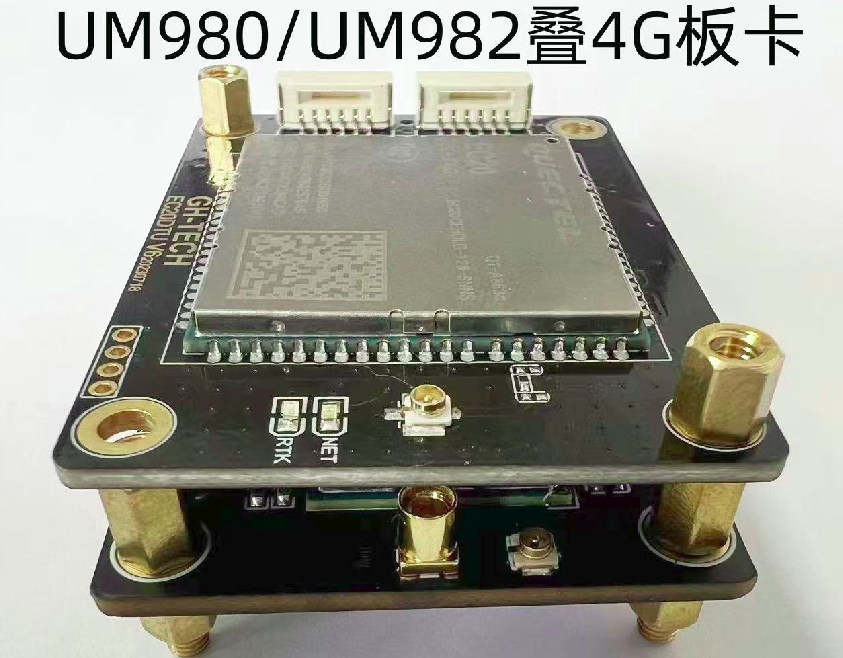

.. _product_gnss:

GNSS模组
==============

为了更好的支持您的开发，我们还提供GNSS RTK模组，并将其和我们的相机进行时间同步，共用一套时间系统，该模组可以选购多种型号UM980，UM982。UM980可以输出鲁棒精确的厘米级经纬度，UM982可以搭配双天线实现精确定向。具体gnss协议如下

.. code-block:: bat

  bool valid; //有效位
  double gnss_timestamp; //gnss sensor_time
  std::string gnss_utc_time; //gnss utc_time
  double latitude; //维度
  double longitude; //经度
  double altitude; //高度
  int fix_type; // 0 - 无效 1 - 单点定位 2 - 差分定位 4 - RTK 固定解 5 - RTK 浮点解
  int satellites_used; //用到的卫星数
  double gps_geoid_height; //海平面高度
  double velocity; //速度
  double heading; //航向，正北为0
  double hdop; //二维水平精度因子
  double vdop; //垂直精度因子
  double pdop; //三维位置精度因子

如果您需要gnss原始伪距和载波做gnss紧耦合算法，可以通过gnss模组的串口获取，具体请联系我们技术支持

