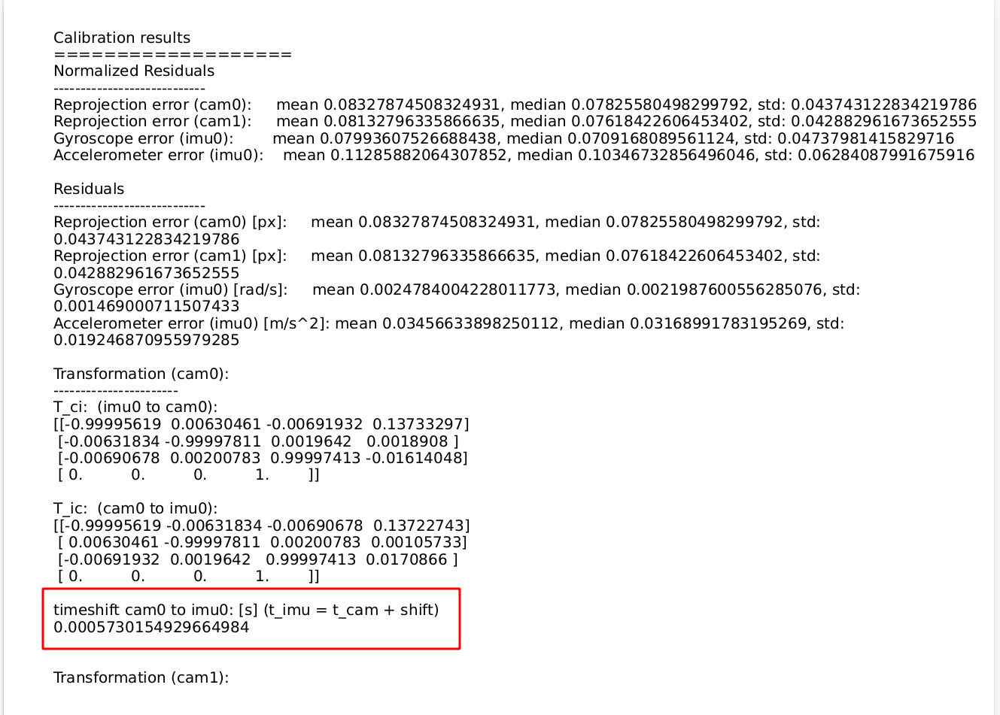
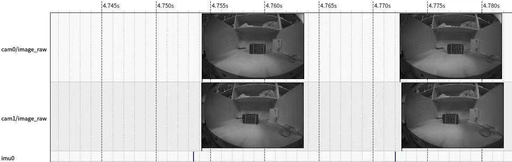

.. _product_time_sync:

时间同步
==========================

CyperStereo为了实现高精度的时间同步，使用了FPGA芯片作为主控，通过FPGA的精确时钟分频同步触发image和imu senosr，同步精度可达1ms以内。

使用kaibr标定出image和imu的时间同步误差如下

image和imu的发送时间戳如下，注意，为了尽量减少下游高频触发callback增加算力，imu的数据是3-4个一起打包发送

