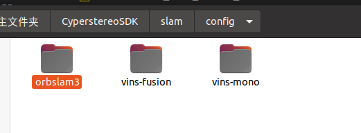
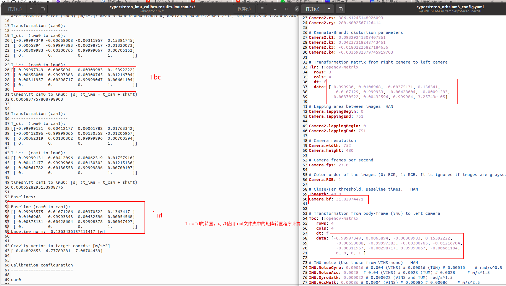
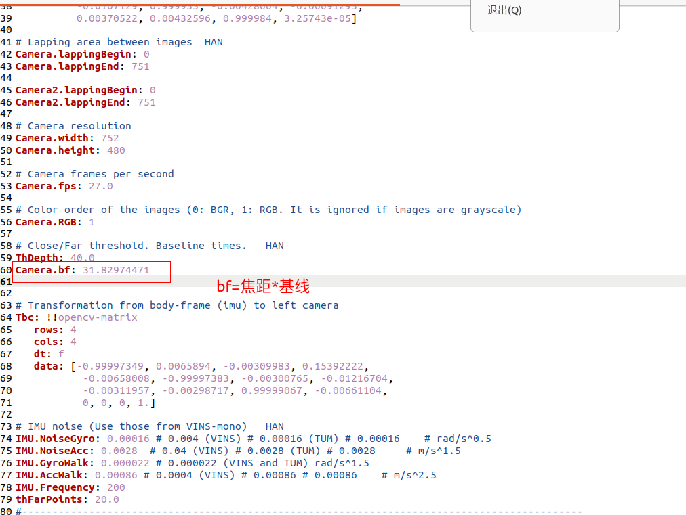

.. _slam_orb_slam3:

`ORB_SLAM3 <https://github.com/UZ-SLAMLab/ORB_SLAM3>`_ 如何跑起来
==============================================================

在 Cyperstereo 上运行 ORB_SLAM3
-----------------------------

1.将相机标定文件转换为orbslam3的配置文件

SDK的slam文件夹下提供orbslam3的通用配置文件，

如果想要更高的精度，需要根据自己相机的标定文件重新填写cyperstereo_orbslam3_config.yaml文件中的内外参，
如下图所示，将cyperstereo_imu_calibra-results-imucam.txt文件中的内外参copy到cyperstereo_orbslam3_config.yaml文件中

.. image:: ../../images/slam/orbslam2.png

.. image:: ../../images/slam/orbslam4.png

替换完成后，将cyperstereo_orbslam3_config.yaml文件放到如下路径CyperStereo文件夹内

.. image:: ../../images/slam/orbslam6.png

2.运行Cyperstereo节点

.. code-block:: bash

  cd (local path of Cyperstereo)
  source ./devel/setup.bash
  rosrun CyperstereoRos capture_image_imu

3.打开另一个命令行运行vins

.. code-block:: bash
  
  cd (local path of vins)
  source ./devel/setup.bash
  rosrun ORB_SLAM3 Stereo_Inertial Vocabulary/ORBvoc.txt Examples/Stereo-Inertial/cyperstereo_orbslam3_config.yaml true