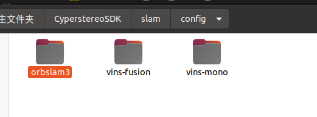
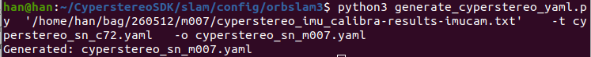
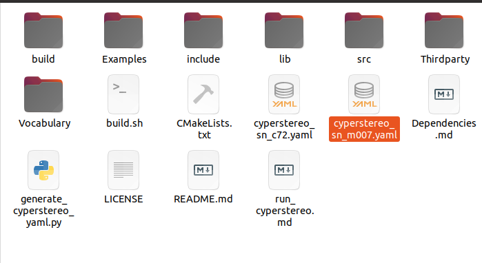

.. _slam_orb_slam3:

`ORB_SLAM3 <https://github.com/UZ-SLAMLab/ORB_SLAM3>`_ 如何跑起来
==============================================================

在 Cyperstereo 上运行 ORB_SLAM3
-----------------------------

1.将相机标定文件转换为orbslam3的配置文件

SDK的slam文件夹下提供orbslam3的通用配置文件，

需要根据自己相机的标定文件重新生成cyperstereo_sn_**.yaml文件，相机的标定文件根据自己相机的sn码找客服获取。

如下图所示，使用~/CyperstereoSDK/slam/config/orbslam3下的generate_cyperstereo_yaml.py脚本将自己相机的标定文件写入到cyperstereo_sn_**.yaml文件中

替换完成后，将cyperstereo_sn_**.yaml文件文件放到如下路径CyperStereo文件夹内

2.运行Cyperstereo ORB_SLAM3

.. code-block:: bash
  
  cd ~
  git clone git@github.com:Cyperstereo/ORB_SLAM3-Cyperstereo.git
  cd ~/ORB_SLAM3-Cyperstereo
  bash build.sh
  ./build/cyperstereo_online Vocabulary/ORBvoc.txt cyperstereo_sn_m007.yaml
