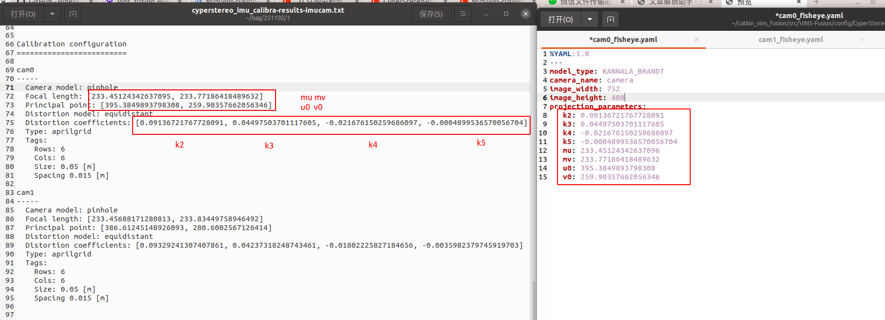
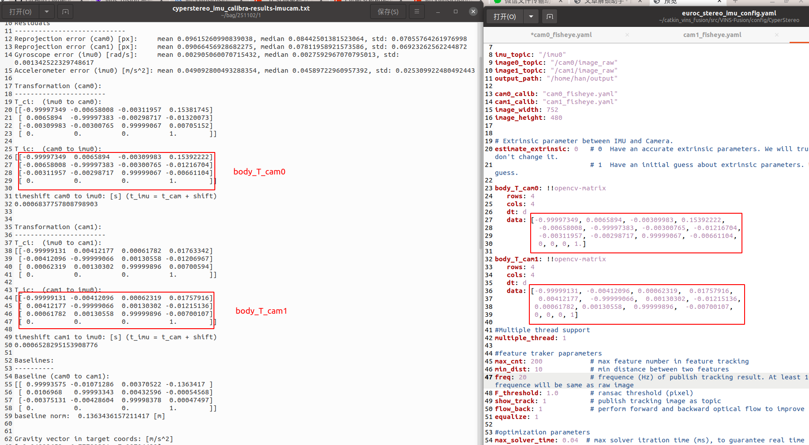

.. _slam_vins_fusion:

`VINS-Fusion <https://github.com/HKUST-Aerial-Robotics/Vins-Fusion>`_ 如何跑起来
==============================================================================

在 Cyperstereo 上运行 VINS-Fusion
-----------------------------

1.将相机标定文件转换为vins_fusion的配置文件

SDK的slam文件夹下提供vins_fusion的通用配置文件，

.. image:: ../../images/slam/vins_fusion3.png

如果想要更高的精度，需要根据自己相机的标定文件重新填写cyperstereo_vins_fusion_config.yaml文件中的内外参，
如下图所示，将cyperstereo_imu_calibra-results-imucam.txt文件中的内外参copy到cyperstereo_vins_fusion_config.yaml文件中

替换完成后，将cyperstereo_vins_fusion_config.yaml文件放到如下路径CyperStereo文件夹内

.. image:: ../../images/slam/vins_fusion4.png

2.运行Cyperstereo节点

.. code-block:: bash

  cd (local path of Cyperstereo)
  source ./devel/setup.bash
  rosrun CyperstereoRos capture_image_imu

3.打开另一个命令行运行vins

.. code-block:: bash
  
  cd (local path of vins)
  source ./devel/setup.bash
  rosrun vins vins_node ~/catkin_ws/src/VINS-Fusion/config/CyperStereo/cyperstereo_vins_fusion_config.yaml
  roslaunch vins vins_rviz.launch
