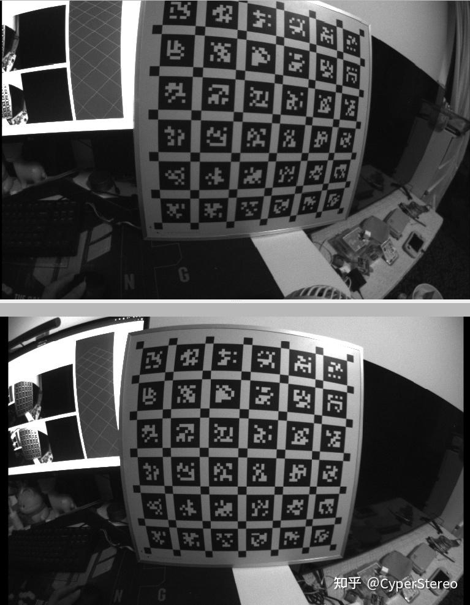
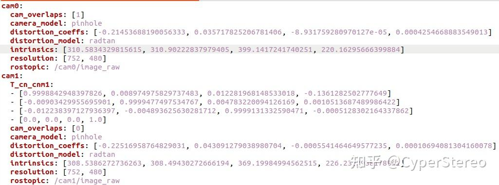
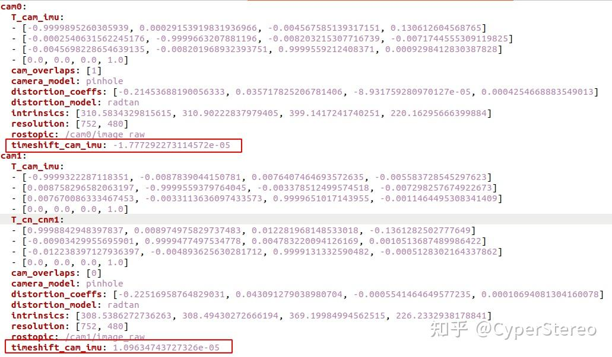

.. _calibration_tool:

相机标定教程
==============

CyperStereo相机提供了一份出厂标定文件，可以跑通VINS-MONO，VINS-Fusion，ORBSLAM3等开源项目，如果使用一段时间后，想要重新标定，可以参考如下文档。本教程基于ROS1实现。

1.kalibr安装
---------------------

a.安装依赖

.. code-block:: bash

   sudo apt-get install -y \
    git wget autoconf automake nano \
    libeigen3-dev libboost-all-dev libsuitesparse-dev \
    doxygen libopencv-dev \
    libpoco-dev libtbb-dev libblas-dev liblapack-dev libv4l-dev
   
   sudo apt-get install -y python3-dev python3-pip python3-scipy \
    python3-matplotlib ipython3 python3-wxgtk4.0 python3-tk python3-igraph
  

b.下载安装

.. code-block:: bash

   mkdir kalibr_ws
   cd kalibr_ws
   mkdir src
   cd src
   git clone https://github.com/ethz-asl/kalibr.git
   catkin_make
   source devel/setup.bash

2.使用SDK中例程采集图像和imu数据
---------------------

c.SDK安装

.. code-block:: bash

   cd ~
   git clone https://github.com/Cyperstereo/CyperstereoSDK.git

   cd ~/CyperstereoSDK/samples
   mkdir build
   cd build
   cmake ..
   make

d.准备aprilgrid标定板

* `april_6x6_80x80cm <https://pan.baidu.com/link/zhihu/7lhnzQuUhnizMVNT1mMCRnN3ZXXu1kZQQV91==#list/path=%2F>`_

根据打印的纸张大小，在april_6x6_80x80cm.yaml文件中tagSize处填入相应的尺寸

.. image:: ../../images/tools/april_tag_size.png

e.启动相机Ros数据采集节点

.. code-block:: bash

   cd ~/CyperstereoSDK/ros
   source ./devel/setup.bash
   rosrun CyperstereoRos capture_image_imu

f.录制数据
录制时参考kalibr的官方教程视频

* `kalibr <https://github.com/ethz-asl/kalibr/wiki>`_

手持相机在空中画八字，确保三轴都有运动激励

.. code-block:: bash

   rosbag record -O cyperstereo_imu_calibra.bag /cam0/image_raw /cam1/image_raw /imu0

3.标定双目
---------------------

.. code-block:: bash

   rosrun kalibr kalibr_calibrate_cameras --bag ./cyperstereo_imu_calibra.bag  --topics /cam0/image_raw  /cam1/image_raw --models pinhole-equi pinhole-equi --target ./april_6x6_80x80cm.yaml

4.标定双目imu
---------------------
imu参考标定文件

* `bmi088_imu_param <https://pan.baidu.com/link/zhihu/7lhXzTuThri3MpBDlnZ3QiRXWsR0RUawda9F==>`_

.. code-block:: bash

   rosrun kalibr kalibr_calibrate_imu_camera --bag ./cyperstereo_imu_calibra.bag  --cam ./cyperstereo_imu_calibra-camchain.yaml --imu ./bmi088_imu_param.yaml --target ./april_6x6_80x80cm.yaml

双目imu同步误差通过FPGA精确时序同步控制在1ms内

标定后的双目重投影误差应在0.2个像素误差左右

.. image:: ../../images/tools/rep.png

